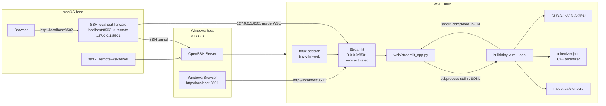

[https://github.com/jmaczan/tiny-vllm](https://github.com/jmaczan/tiny-vllm#intro-llm-vllm-models-inference-servers)

이 프로젝트를 뜯어보면서 LLM 추론 엔진 엔지니어링에 대해 탐구해보려고 한다.

tiny-vllm은 학습 자료로 사용되기에 매우 적합한, 최소기능 버전의 llama 3.2 1B 추론 엔진이다.

솔직히 어디 영상 보고 배우기는 어려운 영역이라, (떠먹여주지 않는 영역 중에서는 가장 쉬운 편인듯) 결국 오픈소스의 힘을 빌려야 한다는 느낌.

해보고 싶은 것이 여러가지 있는데, 우선 해보고 싶은 것은 추론 서버 환경에서의 성능 최적화.

LLM ‘추론 서빙’의 핵심은 단순히 모델을 돌리는 것과는 다르다는 것을 이해해야 한다.

GPU의 심각한 병목 현상, 그리고 최대한 깎아내야 마진을 확보할 수 있는 per-token 비즈니스 모델에서, 추론엔진이 연산 성능 / 메모리 병목을 핸들링하는 전략과 방식, 트릭은 엄청난 힘이 된다.

나도 아직은 큰 그림을 그려나가야 하는 상황이라서, 우선 간단하게 시작해본다.

# 1.0. tiny-vllm과 llama 3.2 1B 이해하기


[https://huggingface.co/rasbt/llama-3.2-from-scratch](https://huggingface.co/rasbt/llama-3.2-from-scratch)

기본 transformer의 틀과 크게 다르지 않다. 그냥 쓰면 되는 것이다. 

<details class="my-6 p-4 bg-gray-50 rounded-xl border border-gray-100 cursor-pointer" markdown="1">
<summary class="font-semibold text-gray-800 select-none">Llama 3.2 1B도 기본적으로는 <strong>GPT 계열과 같은 decoder-only Transformer</strong>입니다. 완전히 다른 구조라기보다, 전통적인 Transformer decoder를 LLM 추론에 맞게 최적화한 변형입니다.</summary>
<div class="mt-4 pl-4 border-l-2 border-gray-200 text-gray-700" markdown="1">

### 핵심 차이

| 항목 | 전통적인 Transformer decoder | Llama 3.2 1B |
| --- | --- | --- |
| Attention | Multi-Head Attention | **Grouped-Query Attention, GQA** |
| 정규화 | LayerNorm, 보통 sublayer 뒤 | **RMSNorm, sublayer 앞** |
| 위치 정보 | 절대 위치 임베딩 | **RoPE** |
| FFN 활성화 | ReLU 등 | **SwiGLU 계열** |
| Attention 범위 | encoder-decoder 또는 causal | **causal self-attention만 사용** |
| 구조 | decoder에 cross-attention 포함 가능 | **cross-attention 없음** |
| 문맥 길이 | 비교적 짧음 | 최대 약 **128K tokens** |
| Vocabulary | 모델마다 다양 | 128,256 tokens |

Meta는 Llama 3.2 텍스트 모델을 decoder-only 모델로 제공하며, 1B 모델도 최대 128K 컨텍스트를 지원합니다. ([Hugging Face](https://huggingface.co/meta-llama/Llama-3.2-1B-Instruct?utm_source=chatgpt.com))

---

### 1. Encoder-decoder의 decoder가 아니라 decoder-only 구조

원래 Transformer 논문의 decoder block에는 다음 두 attention이 들어갑니다.

```
Masked Self-Attention
        ↓
Encoder-Decoder Cross-Attention
        ↓
Feed Forward
```

Llama에는 encoder가 없으므로 cross-attention도 없습니다.

```
Masked Self-Attention
        ↓
Feed Forward
```

입력 문장 전체를 causal mask로 처리하고 다음 토큰을 예측합니다.

```
P(token_t | token_1, ..., token_t-1)
```

즉, 이전 토큰만 볼 수 있고 미래 토큰은 볼 수 없습니다.

---

### 2. Multi-Head Attention 대신 GQA

전통적인 Multi-Head Attention에서는 각 attention head마다 별도의 Q, K, V projection이 있습니다.

```
head 1: Q1, K1, V1
head 2: Q2, K2, V2
...
head 32: Q32, K32, V32
```

Llama 3.2 1B는 **Grouped-Query Attention**을 사용합니다.

Query head는 여러 개지만, 여러 query head가 K/V head를 공유합니다.

개념적으로는 다음과 같습니다.

```
Q head 0 ─┐
Q head 1 ─┼─→ K/V head 0
Q head 2 ─┤
Q head 3 ─┘

Q head 4 ─┐
Q head 5 ─┼─→ K/V head 1
...
```

1B 모델은 32개의 query attention head를 사용합니다. 그림 기준으로는 이 부분이 `Masked grouped-query attention`입니다.

GQA의 주요 목적은 **KV cache 절감**입니다. Auto-regressive decode에서 이전 토큰의 K와 V를 계속 저장해야 하는데, K/V head를 공유하면 메모리 사용량과 메모리 대역폭을 줄일 수 있습니다.

따라서 품질은 일반 Multi-Head Attention에 가깝게 유지하면서도, 토큰을 하나씩 생성하는 decode 단계가 더 효율적입니다.

---

### 3. LayerNorm 대신 RMSNorm

전통적인 Transformer는 일반적으로 LayerNorm을 사용합니다.

LayerNorm은 평균과 분산을 모두 계산합니다.

$$\operatorname{LayerNorm}(x) = \frac{x-\mu}{\sqrt{\sigma^2+\epsilon}}\gamma+\beta$$

Llama는 RMSNorm을 사용합니다.

$$\operatorname{RMSNorm}(x) = \frac{x}{\sqrt{\frac{1}{d}\sum_i x_i^2+\epsilon}}\gamma$$

RMSNorm은 평균을 빼는 과정이 없습니다. 계산이 조금 단순하고, 대규모 언어 모델에서 안정적으로 작동합니다.

그림의 `RMSNorm 1`, `RMSNorm 2`, `Final RMSNorm`이 이에 해당합니다.

---

### 4. Post-Norm 대신 Pre-Norm

원래 Transformer는 대체로 sublayer를 통과한 뒤 정규화하는 Post-Norm 구조였습니다.

```
x → Attention → Add residual → LayerNorm
```

Llama는 정규화를 먼저 수행하는 Pre-Norm 구조입니다.

```
x → RMSNorm → Attention → Add residual
```

수식으로 쓰면 다음과 같습니다.

$$x' = x + \operatorname{Attention}(\operatorname{RMSNorm}(x))$$

$$y = x' + \operatorname{FFN}(\operatorname{RMSNorm}(x'))$$

Pre-Norm은 층이 깊어져도 residual 경로로 gradient가 비교적 안정적으로 전달된다는 장점이 있습니다.

그림에서 residual 선이 RMSNorm과 attention 또는 FFN 전체를 우회해 `+` 노드로 연결되는 이유입니다.

---

### 5. 절대 위치 임베딩 대신 RoPE

전통적인 Transformer는 token embedding에 학습된 positional embedding을 더합니다.

```
input = token_embedding + position_embedding
```

Llama는 별도의 위치 벡터를 단순히 더하는 대신, Query와 Key 벡터를 위치에 따라 회전시키는 **Rotary Positional Embedding, RoPE**를 사용합니다.

개념적으로는 다음과 같습니다.

$$q'_p = R_p q_p$$

$$k'_p = R_p k_p$$

여기서 $R_p$는 위치 $p$에 따라 달라지는 회전 행렬입니다.

이 방식은 attention score에 두 토큰 사이의 상대적 거리 정보가 자연스럽게 반영되도록 합니다.

$$(q'_i)^T k'_j = q_i^T R_{j-i} k_j$$

그림의 `Positional embedding layer`와 `RoPE rescaling`이 이 부분을 표현합니다.

Llama 3.2는 RoPE scaling을 이용해 약 128K 토큰의 긴 컨텍스트를 지원합니다. 다만 그림에서 positional embedding이 token embedding에 직접 더해지는 것처럼 보이는 화살표는 개념적 표현에 가깝습니다. 실제 RoPE는 주로 attention 내부의 Q와 K에 적용됩니다.

---

### 6. 일반 FFN 대신 gated FFN

전통적인 Transformer FFN은 보통 다음과 같습니다.

$$\operatorname{FFN}(x) = W_2 \operatorname{ReLU}(W_1x)$$

Llama는 두 개의 projection을 사용하는 gated 구조를 사용합니다.

$$\operatorname{FFN}(x) = W_{\text{down}} \left[ \operatorname{SiLU}(W_{\text{gate}}x) \odot W_{\text{up}}x \right]$$

흔히 SwiGLU 계열이라고 부릅니다.

그림 오른쪽 확대 부분이 다음 계산을 나타냅니다.

```
                   ┌→ Linear → SiLU ─┐
input ─────────────┤                  × → Linear
                   └→ Linear ────────┘
```

하나는 gate를 만들고, 다른 하나는 값 벡터를 만듭니다. 두 결과를 element-wise multiplication한 후 hidden dimension으로 다시 투영합니다.

1B 모델의 주요 차원은 그림 기준으로 다음과 같습니다.

```
model hidden dimension: 2,048
FFN intermediate dimension: 8,192
decoder layers: 16
attention heads: 32
vocabulary size: 128,256
```

여기서 그림의 `Hidden layer dimension of 8,192`는 모델 전체 hidden size가 아니라 **FFN의 intermediate dimension**으로 보는 것이 정확합니다.

---

### 한 개 block의 실제 흐름

Llama 3.2 1B의 decoder block은 대략 다음과 같습니다.

```
x
│
├──────────────────────────────┐
│                              │
└→ RMSNorm → Q/K/V projection  │
              ↓                │
             RoPE              │
              ↓                │
       Causal GQA attention     │
              ↓                │
        output projection       │
              ↓                │
              + ←───────────────┘
              │
              x'
              │
├──────────────────────────────┐
│                              │
└→ RMSNorm → gated FFN         │
              ↓                │
              + ←───────────────┘
              │
              y
```

이 block을 16회 반복한 뒤 다음을 거칩니다.

```
Final RMSNorm
    ↓
Linear output projection
    ↓
128,256차원 logits
```

### 요약

Llama 3.2 1B는 전통적인 Transformer decoder에서 다음을 바꾼 구조입니다.

```
LayerNorm        → RMSNorm
Post-Norm        → Pre-Norm
Absolute position → RoPE
MHA              → GQA
ReLU FFN         → gated SiLU/SwiGLU FFN
Decoder cross-attention → 제거
```

이 변경들은 새로운 모델 원리를 도입했다기보다, **학습 안정성, 긴 컨텍스트 처리, KV-cache 메모리, autoregressive 생성 속도**를 개선하기 위한 현대적인 decoder-only Transformer 설계라고 보면 됩니다.

</div>
</details>
    

필요한건 그때그때 찾아가면서 보되, 지금 당장은 목표로 하는 라이브 서빙 최적화에 집중해보려고 한다.

그리고 AI가 코딩하도록 할 것이다. 어차피 실무에서도 큰 틀에 대해서 이해하고, 감독하면서 코드짜는건 변하지 않는다. 퇴근하고 짬내서 하는 일인 만큼, 아직 세부적인 최적화를 위해 직접 코딩할 타이밍이 아니다.

# 1.1. 라이브 서빙이 가능한 형태로 개조하기

기본적인 프로젝트의 틀은 N개의 프롬프트에 대해 배치 형태로 서빙을 제공하고, 종료하는 것이다.

이것을 while loop 형태로 고쳤다.


그리고 토크나이저를 추가해서 문장이 보이도록 개선했다.


하지만 cli 환경만으로는 서버를 모사하기엔 제약이 있다. streamlit 서버를 연결한다.



(집의 윈도우 데스크탑을 WSL로 구동하면서, 원격으로 조작하기 위한 눈물겨운 구조라고 해두자)


적당히 작동은 하고 있으나, 프롬프트 결과가 이상하다.


응답이 엉망인듯. 이 부분은 system prompt를 뜯어보고 고치기로.
